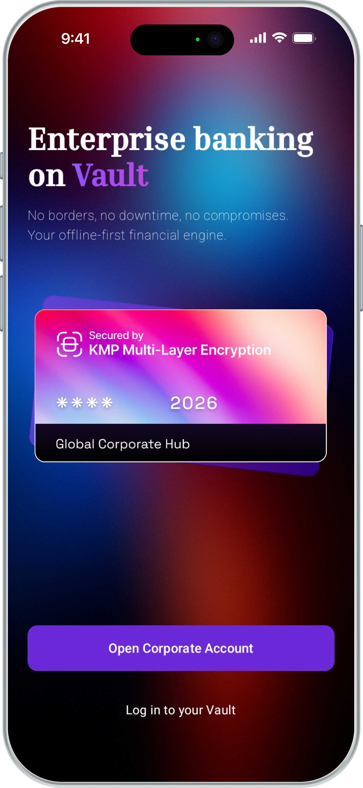
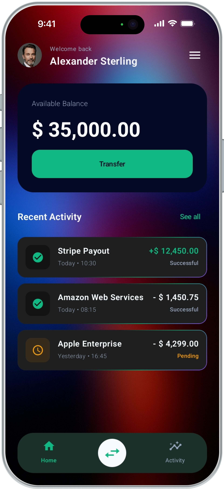
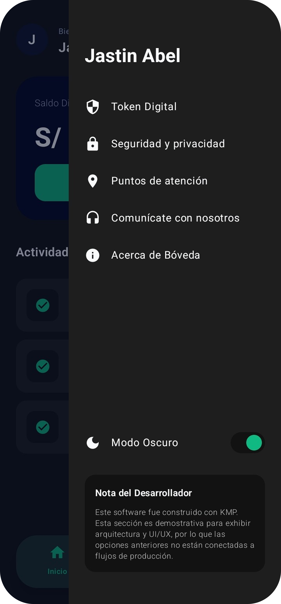
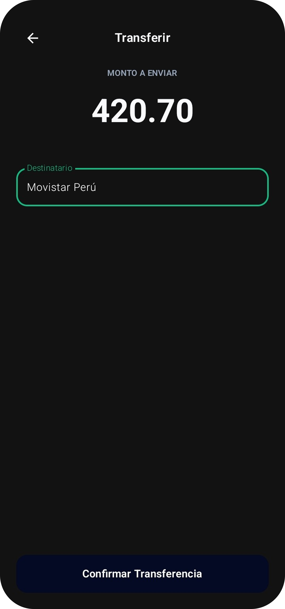
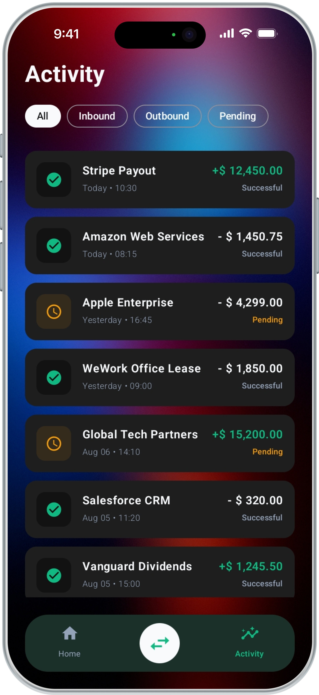
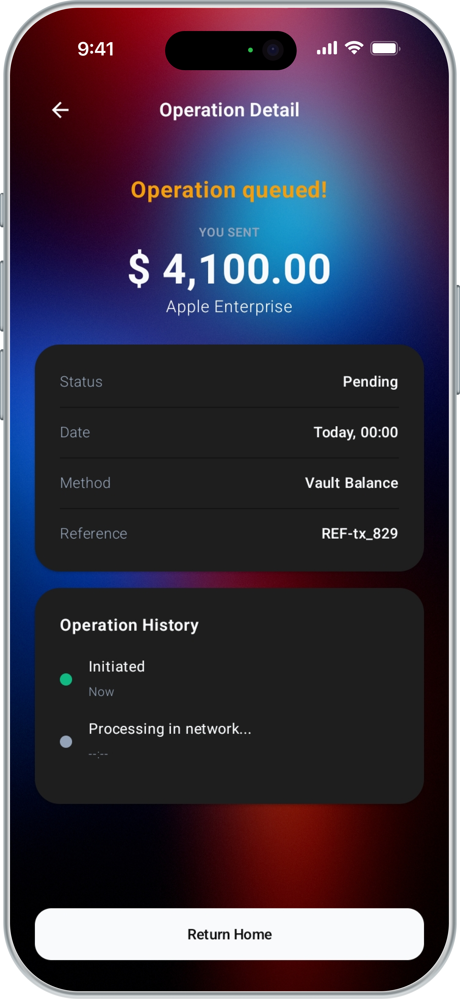
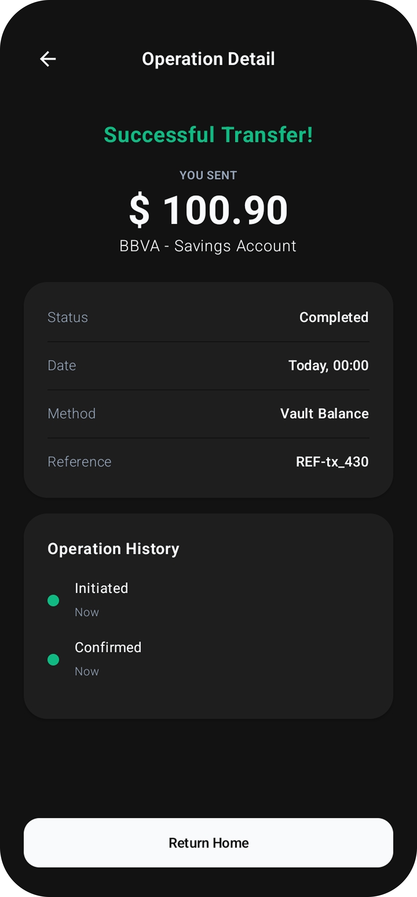
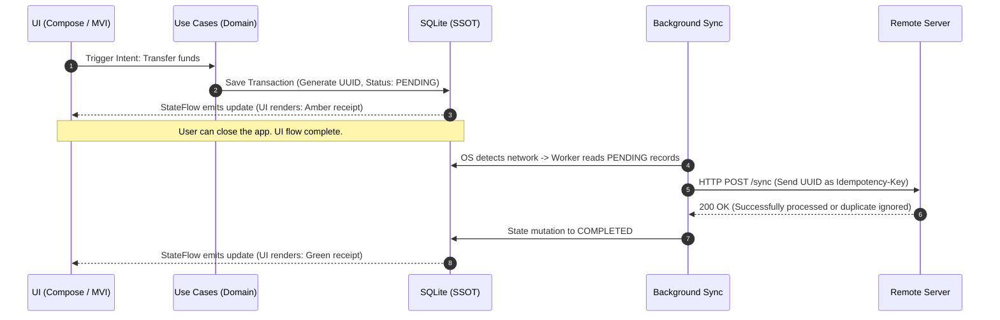

<p align="center">
  
</p>

<h1 align="center"> Bóveda KMP | Enterprise-Grade Fintech Architecture</h1>

> **High-Security, Cross-Platform Fintech Architecture with Offline Availability, Unidirectional Reactivity, and Immersive UI/UX.**

Bóveda KMP is more than just a banking interface. It is an enterprise-grade architectural demonstration (Native Android UI + Multiplatform Core) built on rigorous engineering principles to ensure that financial transactions remain immutable and funds are never duplicated, even when operating with intermittent or no connectivity.

<p align="center">
  <a href="https://kotlinlang.org"></a>
  <a href="https://www.jetbrains.com/lp/compose-multiplatform/"></a>
  
  
</p>

<p align="center">
  <a href="https://github.com/JastinBolanos/Boveda-KMP/releases/download/v1.2.0/BovedaKMP.apk">
    
  </a>
</p>

## User Experience (UI/UX) & Immersive Design
A design focused on transactional fluidity, integrating state-based micro-interactions, cross-platform components, and native support for Dark and Light modes. The application features a fully immersive **Edge-to-Edge architecture** with transparent scaffolds and a persistent global background.

### Premium Micro-Interactions:
* ✨ **Breathing Golden Currency:** A subtle, luxurious pulsing animation on the Transfer Screen's `$` symbol to guide user input.
* 🌊 **Luminous Shimmers & Light Waves:** Fluid light effects on transaction borders and balance indicators to create a "living" interface.
* 🪟 **Glassmorphism & Edge-to-Edge:** Deep, immersive side menus (Drawer) with custom background layers and translucent overlays.

###  Live Demo: Offline-First in Action
> ** Notice the Status Bar:** Pay close attention to the Wi-Fi icon at the very top of the screen. This video demonstrates how the application gracefully handles connectivity drops by securely queuing the transaction locally (**Pending** state), and automatically synchronizing it (**Success** state) the exact second the network is restored.

https://github.com/user-attachments/assets/541a2072-546e-4481-b72a-10f4ee6e872e

<br>

### Interface Showcase

#### 1. Core Banking & Immersive Navigation
> **Glassmorphism, translucent layers, and Edge-to-Edge design.** The user experience begins with a clean corporate interface, an intuitive dashboard with clear visual hierarchy, and a liquid-glass sidebar that maintains the application's context.

<p align="center">
  
  &nbsp;&nbsp;
  
  &nbsp;&nbsp;
  
</p>

#### 2. Fluid Transactions & Activity Tracking
> **Optimized flows and visual feedback.** Transfers feature interactive, illuminated input fields to guide user focus, while the activity history clearly classifies states (completed, pending) using intuitive corporate color codes.

<p align="center">
  
  &nbsp;&nbsp;
  
</p>

#### 3. Offline-First Synchronization States
> **Total connectivity transparency.** When the network drops, the transaction is safely queued (Pending) with an amber indicator. Upon regaining signal, the system processes it and immediately displays the successful receipt (Success) in green, guaranteeing trust with zero data loss.

<p align="center">
  
  &nbsp;&nbsp;
  
</p>

---

## Features
* 🔹 **100% Offline-First** — Works without an internet connection; synchronizes automatically when the signal returns.
* 🔹 **Guaranteed Idempotency** — Designed to make duplicate transactions IMPOSSIBLE.
* 🔹 **Unidirectional State** — The UI reacts only to changes in the local database.
* 🔹 **Future-Proof Architecture** — Single shared codebase driving a fluid native Android UI today, structurally prepared to scale to iOS tomorrow without rewriting business logic.
* 🔹 **Immutable History** — Records are never deleted; they only change state.
* 🔹 **Enterprise Base Capital** — Default corporate environment configured with $35,000.00 base balance for realistic enterprise demonstrations.

---

## Architectural Pillars (Tech Lead Standard)

* **Offline-First (Single Source of Truth):** The application does not rely on the network to function. The local database (`SQLDelight`) serves as the single source of truth. The presentation layer reacts *exclusively* to database mutations via `StateFlow`, never to transient network states.
* **Transactional Idempotency:** Mathematical prevention of "double charging." Each transaction intent generates a locally unique `UUID`. If network fluctuations cause a request to fire multiple times, idempotency control (based on the UUID) ensures funds are moved only once.
* **History Immutability:** Financial records are protected by design. Transactions are neither deleted nor overwritten; they simply transition through a finite state machine (`PENDING` -> `COMPLETED` / `FAILED`).
* **Strict Clean Architecture & MVI:** Absolute separation of concerns with no circular dependencies. The UI is "dumb" (stateless) and dispatches *Intents*. Use cases in the `Domain` layer are framework-agnostic, and `expect/actual` contracts cleanly isolate native iOS and Android implementations.

---

## Data Orchestration and Synchronization

The following flow demonstrates the system's resilience against network failures. The user is never left waiting for a loading spinner; the application records the intent and takes over in the background.


---

## Tech Stack

* **Core & UI:** Kotlin Multiplatform (KMP), Compose Multiplatform
* **Architecture:** Clean Architecture + MVI (Model-View-Intent)
* **Persistence:** SQLDelight (`.sq` dialects and native drivers)
* **Asynchrony & Reactivity:** Kotlin Coroutines + `StateFlow`
* **Dependency Injection:** Koin
* **Version Management:** Gradle Version Catalog (`libs.versions.toml`)

---

## Installation and Execution
The project includes a Gradle Wrapper, eliminating the need for complex configurations. **Clone, sync, and run.**

```bash
git clone [https://github.com/JastinBolanos/Boveda-KMP.git](https://github.com/JastinBolanos/Boveda-KMP.git)
cd BovedaKMP

```

---

## License and Usage Rights
CRITICAL LEGAL NOTICE: This repository is a technical demonstration project designed exclusively for educational, study, and architectural analysis purposes.

Source Code (Software): Licensed under MIT + Commons Clause v1.0. Use in production environments, monetization, handling of real data/funds, and the publication of derivative works constituting plagiarism or trivial modifications (30% Rule) are STRICTLY PROHIBITED. (See the LICENSE file for full terms).

Visual Identity and Branding: Graphic assets, logos, UI designs are NOT open source. They are protected by Copyright © 2026 Jastin Bolaños. Extraction, modification, or commercial use is prohibited. (See the ASSETS_LICENSE.md file).
