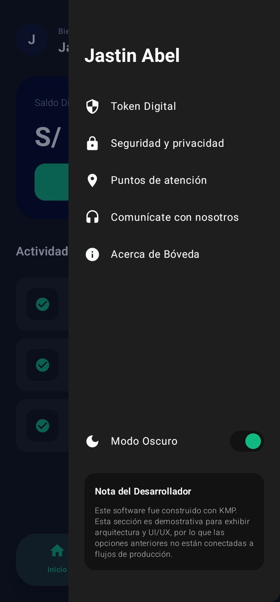
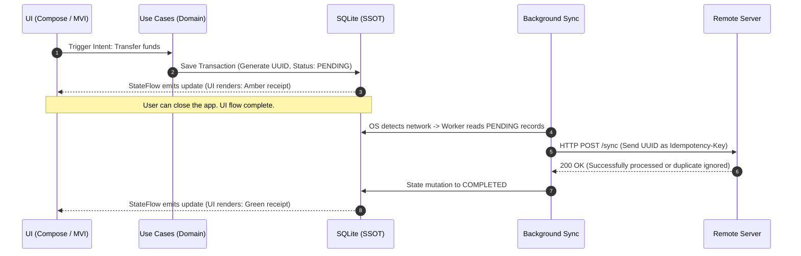

<p align="center">
  
</p>

<h1 align="center"> Bóveda KMP | Enterprise-Grade Fintech Architecture</h1>

> **High-Security, Cross-Platform Fintech Architecture with Offline Availability and Unidirectional Reactivity.**

Bóveda KMP is more than just a banking interface. It is an enterprise-grade architectural demonstration (Android & iOS) built on rigorous engineering principles to ensure that **financial transactions remain immutable and funds are never duplicated**, even when operating with intermittent or no connectivity.

---

## User Experience (UI/UX)
A design focused on transactional fluidity, integrating state-based micro-interactions, cross-platform components, and native support for Dark and Light modes.

<p align="center">
  
  &nbsp;&nbsp;
  
  &nbsp;&nbsp;
  
</p>

<p align="center">
  
  &nbsp;&nbsp;
  
  &nbsp;&nbsp;
  
</p>

<p align="center">
  
</p>

---

## Features
* 🔹 **100% Offline-First** — Works without an internet connection; synchronizes automatically when the signal returns.
* 🔹 **Guaranteed Idempotency** — Designed to make duplicate transactions IMPOSSIBLE.
* 🔹 **Unidirectional State** — The UI reacts only to changes in the local database.
* 🔹 **True Cross-Platform** — Single codebase; native Android and iOS apps.
* 🔹 **Immutable History** — Records are never deleted; they only change state.

---

## Architectural Pillars (Tech Lead Standard)

* **Offline-First (Single Source of Truth):** The application does not rely on the network to function. The local database (`SQLDelight`) serves as the single source of truth. The presentation layer reacts *exclusively* to database mutations via `StateFlow`, never to transient network states.
* **Transactional Idempotency:** Mathematical prevention of "double charging." Each transaction intent generates a locally unique `UUID`. If network fluctuations cause a request to fire multiple times, idempotency control (based on the UUID) ensures funds are moved only once.
* **History Immutability:** Financial records are protected by design. Transactions are neither deleted nor overwritten; they simply transition through a finite state machine (`PENDING` -> `COMPLETED` / `FAILED`).
* **Strict Clean Architecture & MVI:** Absolute separation of concerns with no circular dependencies. The UI is "dumb" (stateless) and dispatches *Intents*. Use cases in the `Domain` layer are framework-agnostic, and `expect/actual` contracts cleanly isolate native iOS and Android implementations.

---

## Data Orchestration and Synchronization

The following flow demonstrates the system's resilience against network failures. The user is never left waiting for a loading spinner; the application records the intent and takes over in the background.


---

## Tech Stack

* **Core & UI:** Kotlin Multiplatform (KMP), Compose Multiplatform
* **Architecture:** Clean Architecture + MVI (Model-View-Intent)
* **Persistence:** SQLDelight (`.sq` dialects and native drivers)
* **Asynchrony & Reactivity:** Kotlin Coroutines + `StateFlow`
* **Dependency Injection:** Koin
* **Version Management:** Gradle Version Catalog (`libs.versions.toml`)

---

## Installation and Execution
The project includes a Gradle Wrapper, eliminating the need for complex configurations. **Clone, sync, and run.**

```bash
git clone [https://github.com/JastinBolanos/Boveda-KMP.git](https://github.com/JastinBolanos/Boveda-KMP.git)
cd BovedaKMP

```

---

## ⚖️ License and Usage Rights
CRITICAL LEGAL NOTICE: This repository is a technical demonstration project designed exclusively for educational, study, and architectural analysis purposes.

Source Code (Software): Licensed under MIT + Commons Clause v1.0. Use in production environments, monetization, handling of real data/funds, and the publication of derivative works constituting plagiarism or trivial modifications (30% Rule) are STRICTLY PROHIBITED. (See the LICENSE file for full terms).

Visual Identity and Branding: Graphic assets, logos, UI designs, and the trade name "Bóveda KMP" are NOT open source. They are protected by Copyright © 2026 Jastin Bolaños. Extraction, modification, or commercial use is prohibited. (See the ASSETS_LICENSE.md file).
