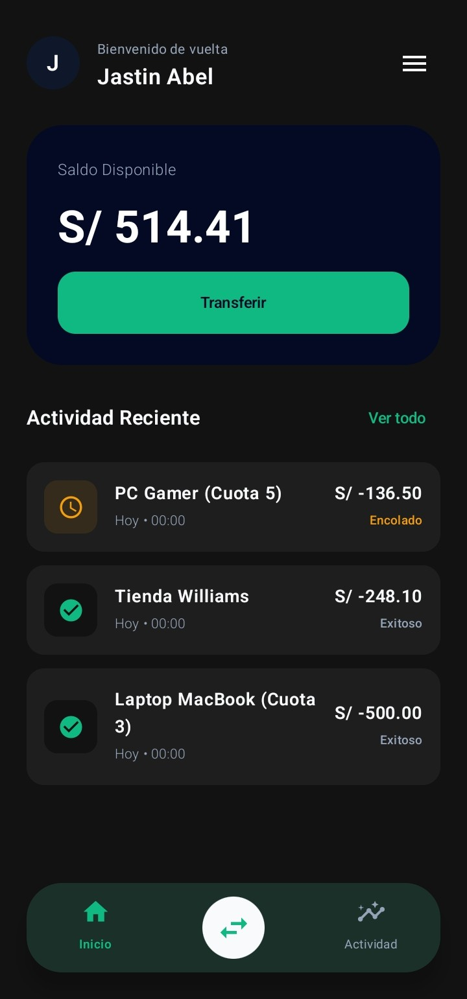
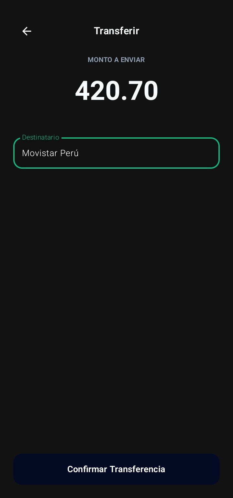
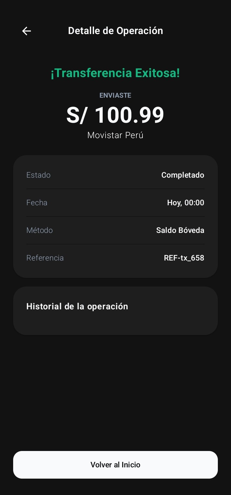
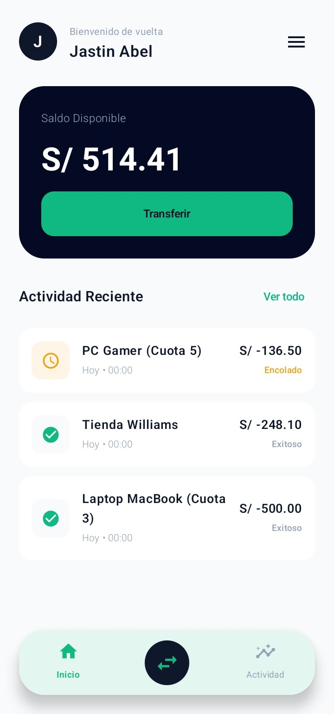
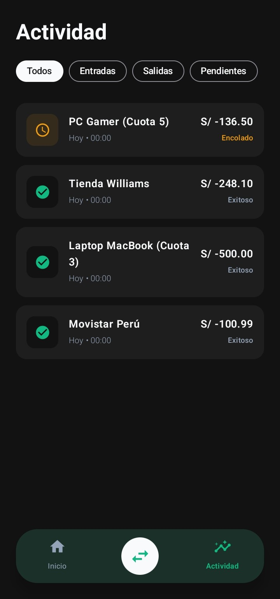
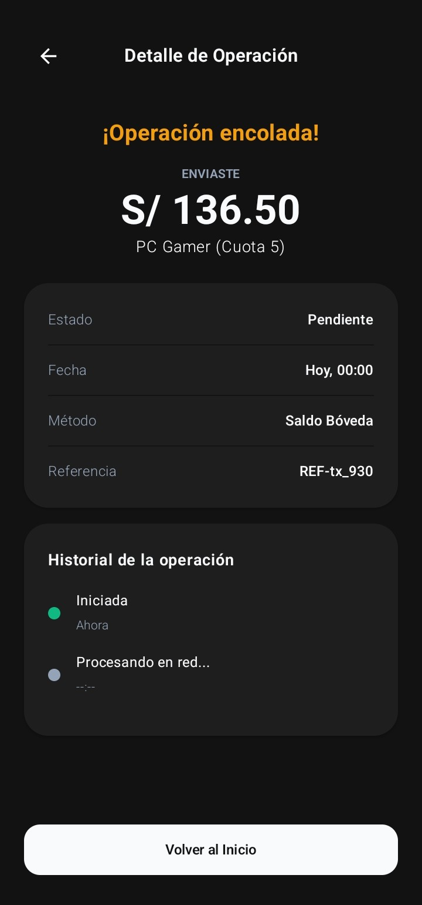
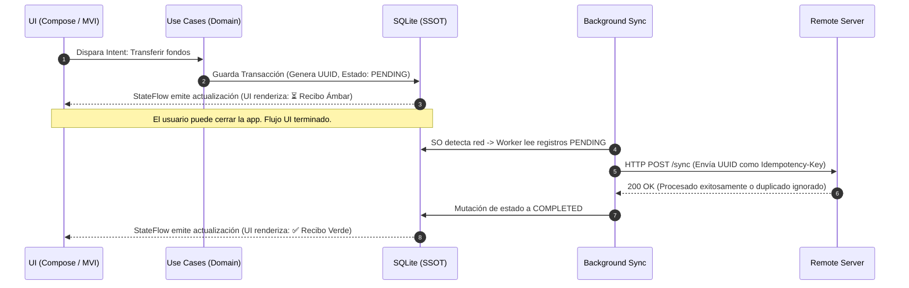

<p align="center">
  
</p>

<h1 align="center">🏦 Bóveda KMP | Enterprise-Grade Fintech Architecture</h1>

> **Arquitectura Fintech Multiplataforma de Alta Seguridad, Disponibilidad Offline y Reactividad Unidireccional.**

Bóveda KMP no es solo una interfaz bancaria. Es una demostración arquitectónica de nivel empresarial (Android & iOS) diseñada con principios de ingeniería estrictos para garantizar que **las transacciones financieras sean inmutables y el dinero nunca se duplique**, incluso operando bajo conectividad intermitente o nula.

---

## 📱 Experiencia de Usuario (UI/UX)
Diseño orientado a la fluidez transaccional, integrando micro-interacciones de estado, componentes multiplataforma y soporte nativo para esquemas Dark/Light Mode.

<p align="center">
  
  &nbsp;&nbsp;
  
  &nbsp;&nbsp;
  
</p>

<p align="center">
  
  &nbsp;&nbsp;
  
  &nbsp;&nbsp;
  
</p>

---

## ✅ Características
* 🔹 **100% Offline First** — Funciona sin internet, sincroniza automáticamente al volver la señal.
* 🔹 **Idempotencia garantizada** — Diseñado para que sea IMPOSIBLE duplicar transacciones.
* 🔹 **Estado unidireccional** — La UI solo reacciona a cambios de la base de datos local.
* 🔹 **Multiplataforma real** — Una sola base de código, apps nativas Android + iOS.
* 🔹 **Historial inmutable** — Los registros nunca se borran, solo cambian de estado.

---

## 🔐 Pilares Arquitectónicos (Tech Lead Standard)

* **Offline-First (Single Source of Truth):** La aplicación no depende de la red para funcionar. La base de datos local (`SQLDelight`) es la única fuente de la verdad. La capa de presentación reacciona *exclusivamente* a las mutaciones de la base de datos a través de `StateFlow`, nunca a estados temporales de red.
* **Idempotencia Transaccional:** Prevención matemática del "doble cobro". Cada intención de transacción genera un `UUID` único localmente. Si la red fluctúa y una petición se dispara múltiples veces, el control de idempotencia (basado en el UUID) asegura que los fondos se muevan una sola vez.
* **Inmutabilidad del Historial:** Los registros financieros están protegidos por diseño. Las transacciones no se eliminan ni se sobreescriben; únicamente transicionan a través de una máquina de estados finitos (`PENDING` -> `COMPLETED` / `FAILED`).
* **Clean Architecture Estricta & MVI:** Separación absoluta de responsabilidades sin dependencias circulares. La UI es "tonta" (Stateless) y dispara *Intents*. Los casos de uso en la capa `Domain` son agnósticos al framework, y los contratos `expect/actual` aíslan impecablemente las implementaciones nativas de iOS y Android.

---

## 🏗 Orquestación de Datos y Sincronización

El siguiente flujo demuestra la robustez del sistema frente a fallos de red. El usuario nunca queda bloqueado esperando un *spinner* de carga; la aplicación registra la intención y asume el control en segundo plano.


---

## 🛠 Stack Tecnológico

* **Core & UI:** Kotlin Multiplatform (KMP), Compose Multiplatform
* **Arquitectura:** Clean Architecture + MVI (Model-View-Intent)
* **Persistencia:** SQLDelight (Dialectos `.sq` y controladores nativos)
* **Asincronía & Reactividad:** Kotlin Coroutines + `StateFlow`
* **Inyección de Dependencias:** Koin
* **Gestión de Versiones:** Gradle Version Catalog (`libs.versions.toml`)

---

## 🚀 Instalación y Ejecución
El proyecto incluye un Wrapper de Gradle, eliminando la necesidad de configuraciones complejas. **Clonar, sincronizar y correr.**

```bash
git clone [https://github.com/JastinBolanos/Boveda-KMP.git](https://github.com/JastinBolanos/Boveda-KMP.git)
cd BovedaKMP

```

---

## ⚖️ Licencia y Derechos de Uso
AVISO LEGAL CRÍTICO: Este repositorio es un proyecto de demostración técnica diseñado exclusivamente para fines educativos, de estudio y análisis arquitectónico.

Código Fuente (Software): Licenciado bajo MIT + Commons Clause v1.0. Queda ESTRICTAMENTE PROHIBIDO su uso en entornos de producción, su monetización, el manejo de datos/dinero real y la publicación de obras derivadas que constituyan plagio o modificaciones triviales (Regla del 30%). (Consulte el archivo LICENSE para conocer los términos completos).

Identidad Visual y Marca: Los recursos gráficos, logotipos, diseños de UI y el nombre comercial "Bóveda KMP" NO son de código abierto. Están protegidos bajo Copyright © 2026 Jastin Bolaños. Prohibida su extracción, modificación o uso comercial. (Consulte el archivo ASSETS_LICENSE.md).
