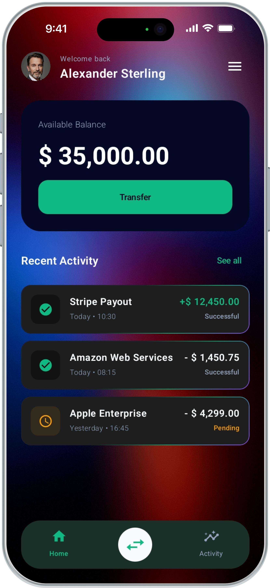
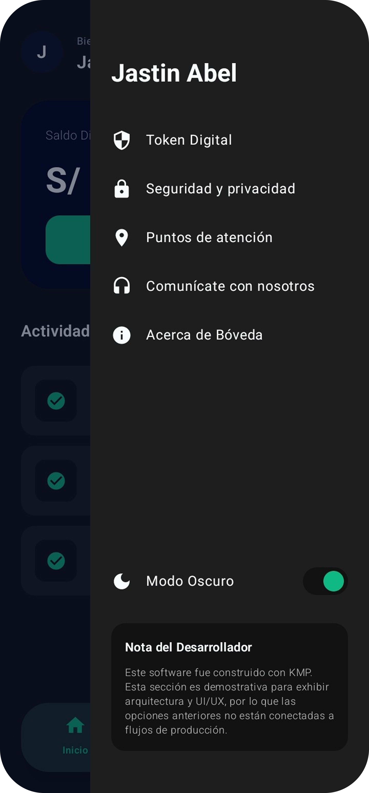
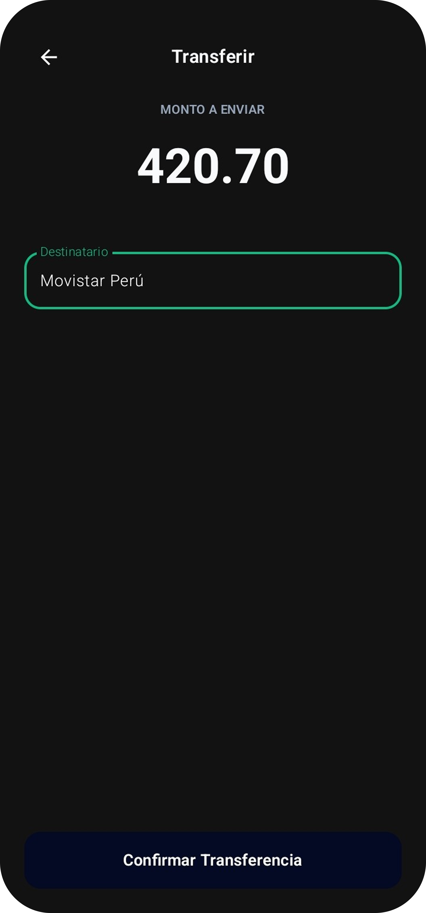
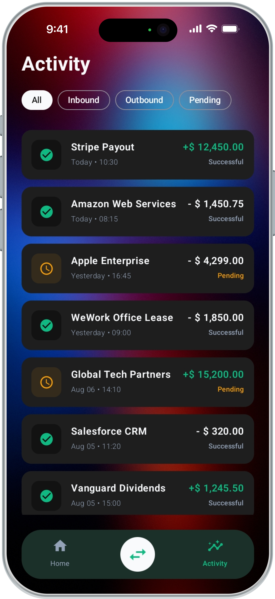
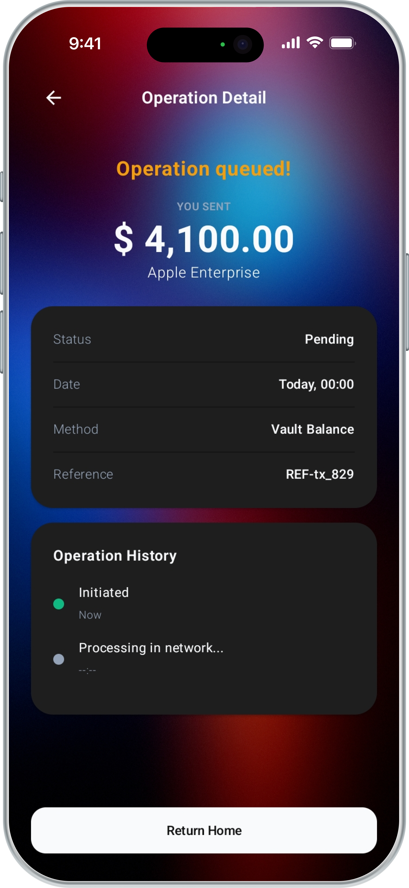
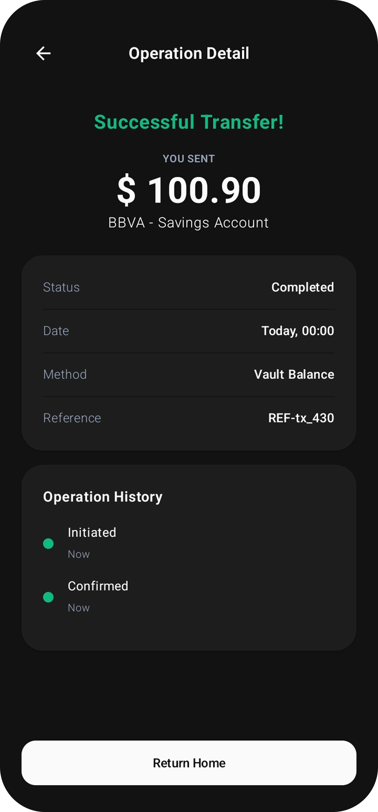
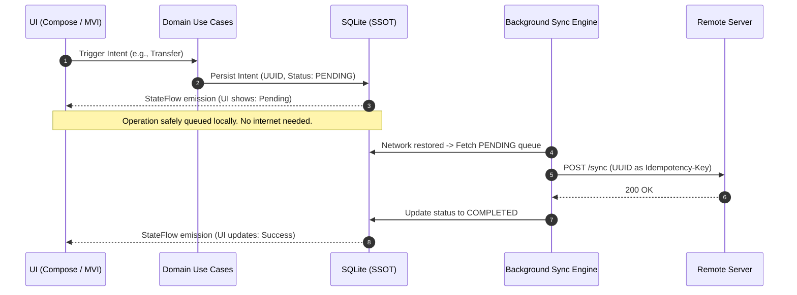

<p align="center">
  
</p>

<h1 align="center">Bóveda KMP</h1>

<p align="center">
  <strong>Offline-First Synchronization Engine (Proof of Concept) built with Kotlin Multiplatform.</strong>
</p>

<p align="center">
  <a href="https://kotlinlang.org"></a>
  <a href="https://www.jetbrains.com/lp/compose-multiplatform/"></a>
  
  
</p>

<p align="center">
  <a href="https://github.com/JastinBolanos/Boveda-KMP/releases/download/v1.2.0/BovedaKMP.apk">
    
  </a>
</p>

---

## Overview

**Transparency note:** While Bóveda KMP features a fintech interface, it is **not a financial application**. It is an architectural playground designed to showcase a custom **offline-first synchronization engine**. 

The UI serves purely as a shell to demonstrate how the underlying engine handles critical operations (like mock transactions) under intermittent or missing network connectivity, guaranteeing idempotency and zero data loss.

---

## App Preview (The UI Shell)

| Dashboard & Menu | Transfers & Activity | Offline Sync Flow |
| :---: | :---: | :---: |
|  <br>  |  <br>  |  <br>  |

---

## The Synchronization Engine

* **Offline-First & Single Source of Truth:** The app uses local SQLite via `SQLDelight`. The engine ensures the UI observes database mutations directly using `StateFlow`, never binding to volatile network calls.
* **Guaranteed Idempotency:** Each operation generates a unique local UUID used as an `Idempotency-Key`. This prevents the engine from executing the same operation twice during network retries.
* **Immutable State Machine:** Records are append-only (`PENDING` → `COMPLETED` / `FAILED`); the engine never deletes or rewrites pending intents.
* **Clean Architecture + MVI:** Total separation of concerns. UI emits intents, domain use cases remain pure, and platform-specific implementations are isolated via `expect/actual`.

---

## How the Engine Handles Failures


```mermaid
sequenceDiagram
    autonumber
    participant UI as UI (Compose / MVI)
    participant Domain as Domain Use Cases
    participant DB as SQLite (SSOT)
    participant Worker as Background Sync Engine
    participant API as Remote Server

    UI->>Domain: Trigger Intent (e.g., Transfer)
    Domain->>DB: Persist Intent (UUID, Status: PENDING)
    DB-->>UI: StateFlow emission (UI shows: Pending)
    Note over UI, DB: Operation safely queued locally. No internet needed.
    Worker->>DB: Network restored -> Fetch PENDING queue
    Worker->>API: POST /sync (UUID as Idempotency-Key)
    API-->>Worker: 200 OK
    Worker->>DB: Update status to COMPLETED
    DB-->>UI: StateFlow emission (UI updates: Success)
    
```
---

## Tech Stack

* **Core & UI:** Kotlin Multiplatform (KMP)
* **Architecture:** Clean Architecture + MVVM
* **Persistence:** SQLDelight 
* **Asynchrony & Reactivity:** Kotlin Coroutines
* **Dependency Injection:** Koin
* **Version Management:** Gradle Version Catalog (`libs.versions.toml`)

---

## Installation and Execution
The project includes a Gradle Wrapper, eliminating the need for complex configurations. **Clone, sync, and run.**

```bash
git clone [https://github.com/JastinBolanos/Boveda-KMP.git](https://github.com/JastinBolanos/Boveda-KMP.git)
cd BovedaKMP

```
